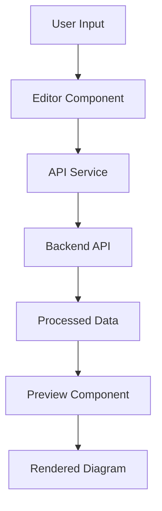

# RenderMD Frontend


[](https://opensource.org/licenses/MIT)
[](https://reactjs.org/)
[](https://vitejs.dev/)
[](CONTRIBUTING.md)
[](https://github.com/Fluxxiondev/RenderMD-frontend/issues)
[](https://github.com/Fluxxiondev/RenderMD-frontend/stargazers)

**RenderMD Frontend** is the client-side component of the RenderMD project — an open-source web application that converts **Markdown-like text** into **interactive, real-time visual diagrams** directly in your browser.

## 🌟 Features

- ⚡ **Real-time Preview**: See diagrams update as you type
- 🎨 **Modern UI**: Clean, responsive design with React 19
- 🚀 **Lightning Fast**: Built with Vite for optimal performance
- 📱 **Mobile Friendly**: Responsive design that works on all devices
- 🔧 **Developer Friendly**: Hot module replacement and fast refresh
- 🎯 **Multiple Diagram Types**: Support for flowcharts, sequence diagrams, and more
- 💾 **Export Options**: Save diagrams in multiple formats
- 🌙 **Dark Mode**: Toggle between light and dark themes

## 🚀 Quick Start

### Prerequisites

- **Node.js** >= 18.0.0
- **npm** >= 9.0.0

### Installation

1. **Clone the repository**
   ```bash
   git clone https://github.com/Fluxxiondev/RenderMD-frontend.git
   cd RenderMD-frontend
   ```

2. **Install dependencies**
   ```bash
   npm install
   ```

3. **Start the development server**
   ```bash
   npm run dev
   ```

4. **Open your browser**
   ```
   http://localhost:3001
   ```

## 📁 Project Structure

```
RenderMD-frontend/
├── public/             # Static assets
├── src/
│   ├── components/     # React components
│   ├── hooks/         # Custom React hooks
│   ├── services/      # API services
│   ├── styles/        # CSS/SCSS files
│   ├── utils/         # Utility functions
│   ├── App.jsx        # Main App component
│   └── main.jsx       # Entry point
├── .github/           # GitHub workflows and templates
├── package.json
├── vite.config.js     # Vite configuration
└── README.md
```

## 🎯 Available Scripts

```bash
# Development
npm run dev          # Start development server with HMR
npm run build        # Build for production
npm run preview      # Preview production build locally

# Code Quality
npm run lint         # Run ESLint
npm run lint:fix     # Fix ESLint issues
npm run format       # Format code with Prettier
npm run format:check # Check code formatting

# Testing
npm test            # Run tests
npm run test:watch  # Run tests in watch mode
npm run test:coverage # Generate test coverage report
```

## 🔧 Configuration

### Environment Variables

Create a `.env` file in the root directory:

```env
# API Configuration
VITE_API_URL=http://localhost:3000
VITE_API_VERSION=v1

# Application Settings
VITE_APP_TITLE=RenderMD
VITE_APP_DESCRIPTION=Convert Markdown to Interactive Diagrams

# Feature Flags
VITE_ENABLE_DARK_MODE=true
VITE_ENABLE_EXPORT=true
VITE_ENABLE_COLLABORATION=false
```

### Vite Configuration

The project uses Vite with React and includes:

- **Fast Refresh**: Instant updates during development
- **React Compiler**: Experimental React compiler for optimization
- **ESLint Integration**: Code quality checks
- **TypeScript Support**: Ready for TypeScript adoption

## 🎨 UI Components

### Core Components

- **Editor**: Markdown input with syntax highlighting
- **Preview**: Real-time diagram rendering
- **Toolbar**: Action buttons and settings
- **ExportDialog**: Multiple export format options
- **ThemeToggle**: Light/dark mode switcher

### Diagram Types Supported

- 📊 **Flowcharts**: Process flows and decision trees
- 🔄 **Sequence Diagrams**: Interaction timelines
- 🏗️ **Class Diagrams**: Object-oriented design
- 📈 **Gantt Charts**: Project timelines
- 🧠 **Mind Maps**: Hierarchical information
- 📋 **Pie Charts**: Data visualization
- 🌊 **Git Graphs**: Version control flows
- 🗂️ **Entity Relationships**: Database design
- 🔄 **State Diagrams**: System states and transitions

## 🚀 Development

### Getting Started

1. **Fork the repository**
2. **Clone your fork**
   ```bash
   git clone https://github.com/YOUR_USERNAME/RenderMD-frontend.git
   ```
3. **Create a feature branch**
   ```bash
   git checkout -b feature/amazing-feature
   ```
4. **Install dependencies**
   ```bash
   npm install
   ```
5. **Start development server**
   ```bash
   npm run dev
   ```

### Code Style

We use ESLint and Prettier for consistent code formatting:

```javascript
// ✅ Good
const DiagramComponent = ({ content, type, onUpdate }) => {
  const [isLoading, setIsLoading] = useState(false);
  
  const handleContentChange = useCallback((newContent) => {
    setIsLoading(true);
    onUpdate(newContent);
    setIsLoading(false);
  }, [onUpdate]);

  return (
    <div className="diagram-container">
      {isLoading ? <Spinner /> : <Diagram content={content} type={type} />}
    </div>
  );
};
```

### Architecture



## 🤝 Contributing

We welcome contributions from the community! Here's how you can help:

### Ways to Contribute

- 🐛 **Report Bugs**: Found a bug? [Open an issue](https://github.com/Fluxxiondev/RenderMD-frontend/issues/new?template=bug_report.md)
- 💡 **Suggest Features**: Have an idea? [Request a feature](https://github.com/Fluxxiondev/RenderMD-frontend/issues/new?template=feature_request.md)
- 🎨 **Improve UI/UX**: Make the interface more intuitive
- 📝 **Write Documentation**: Help improve our docs
- 🧪 **Add Tests**: Increase test coverage
- 🔧 **Fix Issues**: Check out [good first issues](https://github.com/Fluxxiondev/RenderMD-frontend/labels/good%20first%20issue)

### Development Workflow

1. **Issues First**: Create or find an issue before starting work
2. **Branch Naming**: Use `feature/`, `fix/`, `docs/`, or `test/` prefixes
3. **Commit Messages**: Follow [Conventional Commits](https://conventionalcommits.org/)
4. **Pull Requests**: Use our PR template and ensure all checks pass
5. **Code Review**: All PRs require review before merging

Please read our [Contributing Guidelines](CONTRIBUTING.md) for detailed information.

## 🧪 Testing

```bash
# Run all tests
npm test

# Run tests in watch mode
npm run test:watch

# Generate coverage report
npm run test:coverage

# Run specific test file
npm test -- --testPathPattern=component.test.jsx
```

### Testing Strategy

- **Unit Tests**: Individual component testing
- **Integration Tests**: Component interaction testing
- **E2E Tests**: Full application workflow testing
- **Visual Regression**: UI consistency testing

## 🎯 Performance

### Optimization Features

- **Code Splitting**: Lazy loading of components
- **Bundle Analysis**: Webpack bundle analyzer
- **Image Optimization**: Responsive images with lazy loading
- **Caching**: Service worker for offline support
- **Minification**: Production build optimization

### Performance Metrics

We aim for:
- **Lighthouse Score**: 90+ across all categories
- **First Contentful Paint**: < 1.5s
- **Time to Interactive**: < 3s
- **Bundle Size**: < 500KB (gzipped)

## 🌍 Browser Support

- **Chrome**: Latest 2 versions
- **Firefox**: Latest 2 versions  
- **Safari**: Latest 2 versions
- **Edge**: Latest 2 versions
- **Mobile**: iOS Safari, Chrome Mobile

## 📚 Resources

- [Contributing Guidelines](CONTRIBUTING.md)
- [Code of Conduct](CODE_OF_CONDUCT.md)
- [Changelog](CHANGELOG.md)
- [License](LICENSE)
- [API Documentation](https://github.com/Fluxxiondev/RenderMD-backend)

## 🎯 Roadmap

- [ ] TypeScript migration
- [ ] Advanced diagram editing tools
- [ ] Real-time collaboration
- [ ] Plugin system for custom diagram types
- [ ] Advanced export options (PNG, SVG, PDF)
- [ ] Template gallery
- [ ] Keyboard shortcuts
- [ ] Accessibility improvements

## 🐛 Known Issues

Check our [Issues page](https://github.com/Fluxxiondev/RenderMD-frontend/issues) for current known issues and their status.

## 📄 License

This project is licensed under the MIT License - see the [LICENSE](LICENSE) file for details.

## 🙏 Acknowledgments

- Thanks to all contributors who have helped this project grow
- Built with React, Vite, and modern web technologies
- Inspired by the need for better Markdown visualization tools
- Special thanks to the open-source community

---

⭐ **Star this repository if you find it helpful!**

**Happy Contributing! 🚀**
